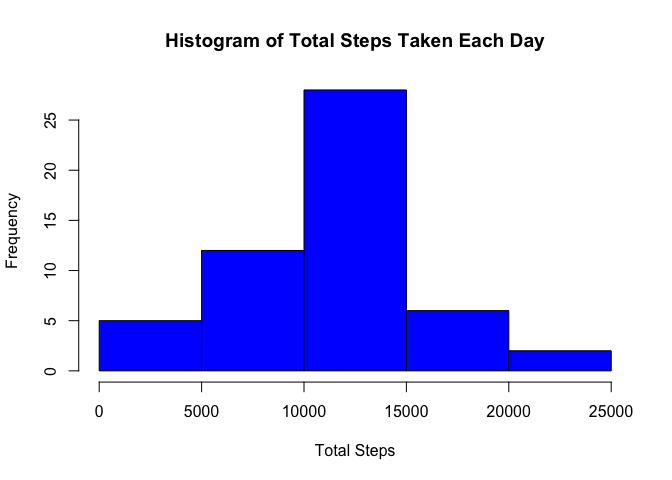
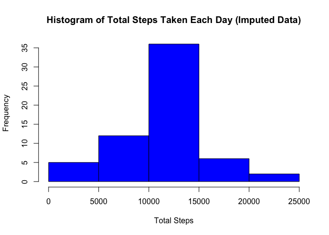
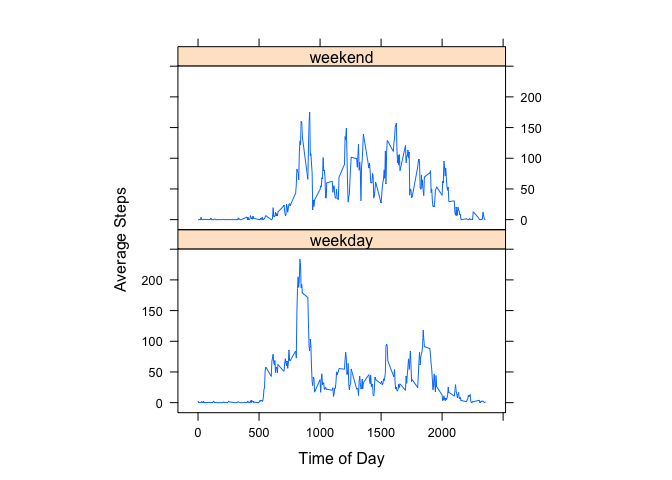

# Reproducible Research: Peer Assessment 1
Author: Eddie Kollar

## Loading and preprocessing the data


```r
unzip("activity.zip")
raw_data <- read.csv("activity.csv")
```

Preprocessing includes ignoring NA values for now.


```r
activity_data <- raw_data[!is.na(raw_data$steps),]
```

## What is mean total number of steps taken per day?


```r
require(plyr)
```

```
## Loading required package: plyr
```

```r
sum_steps_date <-ddply(activity_data, .(date), summarise, total_steps = sum(steps))
hist(sum_steps_date$total_steps, xlab="Total Steps", main = "Histogram of Total Steps Taken Each Day", col = "blue")
```

 

The mean of the total steps taken per day:

```r
mean_steps <- mean(sum_steps_date$total_steps)
mean_steps
```

```
## [1] 10766
```

Medain of the total steps taken per day:

```r
median_steps <- median(sum_steps_date$total_steps)
median_steps
```

```
## [1] 10765
```

## What is the average daily activity pattern?


```r
mean_steps_interval <- ddply(activity_data, .(interval), summarise, mean_steps = mean(steps))
plot(mean_steps_interval, type = "l", xlab = "Interval", ylab="Average Number of Steps")
```

 

At the interval 835 we find the maximum value average number of steps at 206.1698

## Imputing missing values

There are 2304 rows with missing values. The strategy for replacing missing values will be to use the rounded mean value for the interval.


```r
mean_steps_interval <- ddply(activity_data, .(interval), summarise, mean_steps = mean(steps))
imputated_data <- raw_data

new_steps_data <- sapply(imputated_data$interval[is.na(imputated_data$steps)], function(x){
        steps <- mean_steps_interval$mean_steps[which(mean_steps_interval$interval == x)]
        round(steps)
})

imputated_data$steps[is.na(imputated_data$steps)] <- new_steps_data

new_sum_steps <-ddply(imputated_data, .(date), summarise, total_steps = sum(steps))
```

The mean of the total steps taken per day with imputed data:

```r
mean_steps <- mean(new_sum_steps$total_steps)
mean_steps
```

```
## [1] 10766
```

Medain of the total steps taken per day with imputed data:

```r
median_steps <- median(new_sum_steps$total_steps)
median_steps
```

```
## [1] 10762
```


```r
hist(new_sum_steps$total_steps, xlab="Total Steps", main = "Histogram of Total Steps Taken Each Day (Imputed Data)", col = "blue")
```

 

The imputed mean is the same and the median of the imputed data is slightly smaller. This information, along with the histogram, we can see that imputation does not seem to have a significant impact in this case. 

## Are there differences in activity patterns between weekdays and weekends?

The graphs show that there is more activity in the early hours of the morning on weekdays. The daily activity begins slighly before 6:00 am and sharply increases at 8:10 am before peaking at 8:35 am. There is a drop off from 9:10 am to 9:30 am. This period from 8:10 to 9:30 is presumably when the majority of subjects are waking up for the workday, preparing, and commuting to work.

The day begins later for the subjects on the weekends, but there is more activity throughout the day in comparison with the weekdays.


```r
activity_data$day_type <- sapply(activity_data$date, function(x) {
    weekend <- c("Saturday", "Sunday")
    if(weekdays(as.Date(x)) %in% weekend) "weekend" else "weekday"
})

activity_data$day_type <- as.factor(activity_data$day_type)

steps_by_day_type <- ddply(activity_data, .(interval, day_type), summarise, total_steps = mean(steps))

library(lattice)
xyplot(total_steps~interval|day_type,data=steps_by_day_type,aspect=1/2,type="l", ylab = "Average Steps", xlab="Time of Day")
```

 
